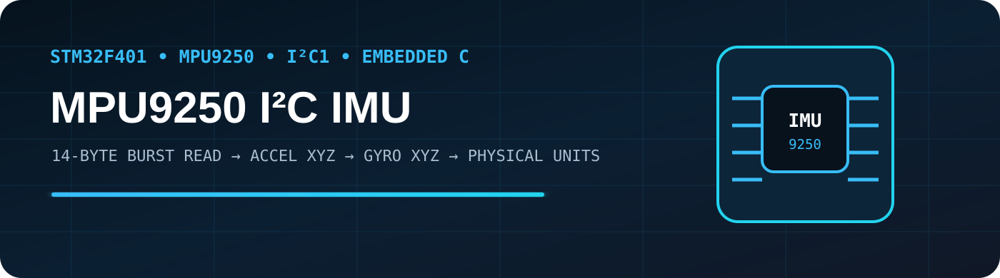
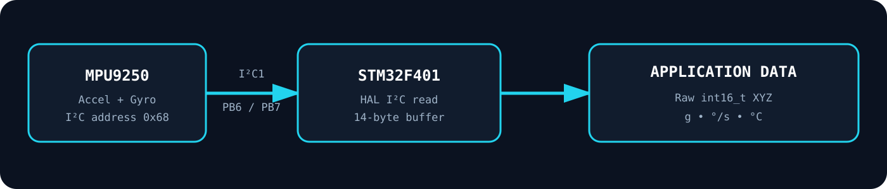
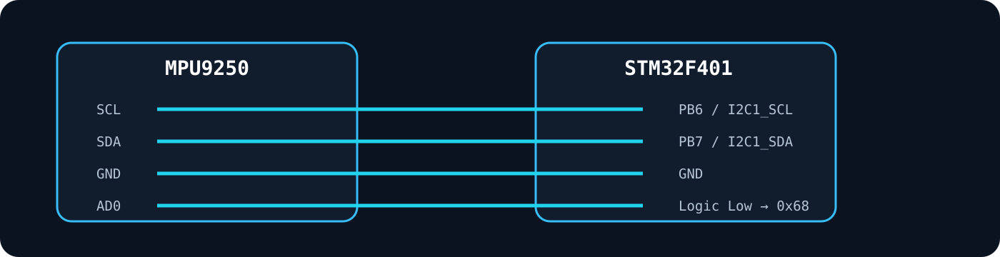
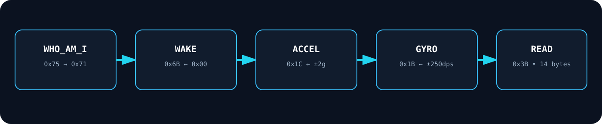

<div align="center">



# STM32F401 + MPU9250 I²C IMU

### Raw accelerometer & gyroscope acquisition on STM32F401 using STM32 HAL

[](#)
[](#)
[](#)
[](#)
[](#)

**Original STM32CubeIDE project preserved + cleaned reusable driver included**

</div>

---

## 🚀 Project overview

This project reads **accelerometer and gyroscope data from an MPU9250 over I²C** using an STM32F401.

The original STM32CubeIDE project:

- configures `I2C1`;
- wakes the MPU9250;
- selects **±2 g** accelerometer range;
- selects **±250 °/s** gyroscope range;
- performs a **14-byte burst read** beginning at register `0x3B`;
- extracts raw `X/Y/Z` acceleration and angular-rate values;
- repeats the acquisition every **100 ms**.

The archived project build completed with **0 errors and 0 warnings**.

> **Scope note:** the MPU9250 contains a magnetometer too, but the original project only reads the accelerometer and gyroscope. This repository keeps that scope clear instead of claiming unused sensor features.

---

## 🧠 System architecture



```text
MPU9250
   │
   │  I²C @ 100 kHz
   │  SDA / SCL
   ▼
STM32F401
   │
   ├── 14-byte burst read
   │
   ├── Accel X / Y / Z
   ├── Gyro  X / Y / Z
   └── Temperature register
   │
   ▼
Application / Debug Output
```

---

## ⚙️ Original CubeMX configuration

| Setting | Original project |
|---|---|
| STM32 target | `STM32F401C(D-E)Ux` |
| Package | `UFQFPN48` |
| System clock | `16 MHz` HSI |
| Peripheral | `I2C1` |
| I²C speed | `100 kHz` |
| SCL | `PB6` |
| SDA | `PB7` |
| MPU9250 7-bit address | `0x68` |
| Accelerometer range | `±2 g` |
| Gyroscope range | `±250 °/s` |
| Original loop delay | `100 ms` |

The exact CubeMX configuration is preserved in:

```text
original_source/STM32F401CE.ioc
```

---

## 🔩 Wiring



| MPU9250 | STM32F401 |
|---|---|
| `VCC` | Use the supply required by your breakout board |
| `GND` | `GND` |
| `SCL` | `PB6` (`I2C1_SCL`) |
| `SDA` | `PB7` (`I2C1_SDA`) |
| `AD0` | Low for address `0x68` |

> Breakout boards differ. Confirm the module's regulator/logic-level requirements before powering it.

---

## 📡 Register flow



The original driver uses:

| Register | Address | Purpose |
|---|---:|---|
| `PWR_MGMT_1` | `0x6B` | Wake the sensor |
| `GYRO_CONFIG` | `0x1B` | Select gyro full-scale range |
| `ACCEL_CONFIG` | `0x1C` | Select accel full-scale range |
| `ACCEL_XOUT_H` | `0x3B` | Start of 14-byte sensor-data block |

The cleaned driver additionally checks:

| Register | Address | Expected |
|---|---:|---:|
| `WHO_AM_I` | `0x75` | `0x71` for MPU9250 |

---

## 📦 14-byte sensor frame

Starting from `0x3B`, the sensor data block is:

```text
Byte  0–1   ACCEL_X
Byte  2–3   ACCEL_Y
Byte  4–5   ACCEL_Z
Byte  6–7   TEMPERATURE
Byte  8–9   GYRO_X
Byte 10–11  GYRO_Y
Byte 12–13  GYRO_Z
```

Each measurement is reconstructed as a signed 16-bit value:

```c
(int16_t)(((uint16_t)high_byte << 8U) | low_byte)
```

---

## 🧮 Raw → engineering units

The cleaned driver keeps the original full-scale settings and can convert the raw values:

```text
Acceleration (g) = raw / 16384
Gyroscope (°/s)  = raw / 131
Temperature (°C) = raw / 333.87 + 21
```

These conversion factors correspond to the ranges configured in this repository.

---

## 💻 Original application flow

The preserved `main.c` performs:

```c
MPU9250_Init();

while (1)
{
    Read_Accel_Gyro(accel, gyro);

    printf("Accel: X=%d, Y=%d, Z=%d\n",
           accel[0], accel[1], accel[2]);

    printf("Gyro: X=%d, Y=%d, Z=%d\n",
           gyro[0], gyro[1], gyro[2]);

    HAL_Delay(100);
}
```

`printf()` is present in the original source. Where those characters appear depends on the project's retargeting/debug configuration.

---

## ✨ Clean reusable driver

A cleaner version is provided under:

```text
firmware/Core/Inc/mpu9250.h
firmware/Core/Src/mpu9250.c
```

It adds:

- `WHO_AM_I` verification;
- explicit HAL error handling;
- null-pointer checks;
- named register constants;
- raw-data structure;
- engineering-unit structure;
- accelerometer conversion to `g`;
- gyroscope conversion to `°/s`;
- temperature conversion to `°C`.

Example:

```c
MPU9250_RawData raw;
MPU9250_Data data;

if (MPU9250_Init(&hi2c1) == MPU9250_OK)
{
    if (MPU9250_ReadRaw(&hi2c1, &raw) == MPU9250_OK)
    {
        MPU9250_Convert(&raw, &data);
    }
}
```

---

## 📁 Repository structure

```text
STM32F401-MPU9250-I2C-IMU/
│
├── README.md
├── GITHUB_SETUP.md
├── STM32CUBEIDE_SETUP.md
├── .gitignore
│
├── original_source/
│   ├── STM32F401CE.ioc
│   ├── Core/
│   │   ├── Inc/
│   │   ├── Src/
│   │   └── Startup/
│   └── *.ld
│
├── firmware/
│   └── Core/
│       ├── Inc/
│       │   └── mpu9250.h
│       └── Src/
│           ├── mpu9250.c
│           └── main_integration_example.c
│
├── docs/
│   ├── ORIGINAL_PROJECT_NOTES.md
│   ├── BUILD_STATUS.md
│   └── TESTING_CHECKLIST.md
│
├── examples/
│   └── expected_output_format.txt
│
└── assets/
    ├── repo-banner.svg
    ├── system-architecture.svg
    ├── wiring.svg
    └── register-flow.svg
```

---

## 🛠️ Build the original project

Open:

```text
original_source/STM32F401CE.ioc
```

in STM32CubeIDE / STM32CubeMX.

If HAL/CMSIS generated files are missing in your environment, regenerate the code from the `.ioc`, then keep the original `Core/Src/mpu9250.c` and `Core/Inc/mpu9250.h`.

For a cleaner integration, copy the driver from `firmware/` instead.

Detailed instructions:

**[`STM32CUBEIDE_SETUP.md`](STM32CUBEIDE_SETUP.md)**

---

## ✅ Original build status

```text
STM32CubeIDE incremental build
Errors   : 0
Warnings : 0
```

This status belongs to the archived original `STM32F401CE` project.

The cleaned driver was prepared from the same register flow, but real-hardware execution of the cleaned version was not performed while packaging this repository.

---

## 🧪 Suggested hardware checks

Before considering a run successful:

- `WHO_AM_I` returns `0x71`;
- I²C transactions return `HAL_OK`;
- acceleration changes when the board is tilted;
- gyro values react when the board is rotated;
- at rest, one acceleration axis is typically dominated by gravity depending on orientation;
- data changes without repeatedly saturating at signed 16-bit limits.

---

## 🧰 Technologies demonstrated

`STM32F401` · `STM32CubeIDE` · `STM32 HAL` · `Embedded C` · `I²C` · `MPU9250` · `IMU` · `Sensor Registers` · `Firmware Debugging`

---

## 📌 Why this project is useful

This repository demonstrates the low-level path from a physical IMU to firmware data:

```text
Sensor register
      ↓
I²C transaction
      ↓
Byte buffer
      ↓
Signed 16-bit values
      ↓
Physical units
      ↓
Application logic
```

That same pattern is reusable in robotics, attitude sensing, embedded telemetry, balancing systems, and flight-control experiments.

---

## 📄 License

No license is included by default.
